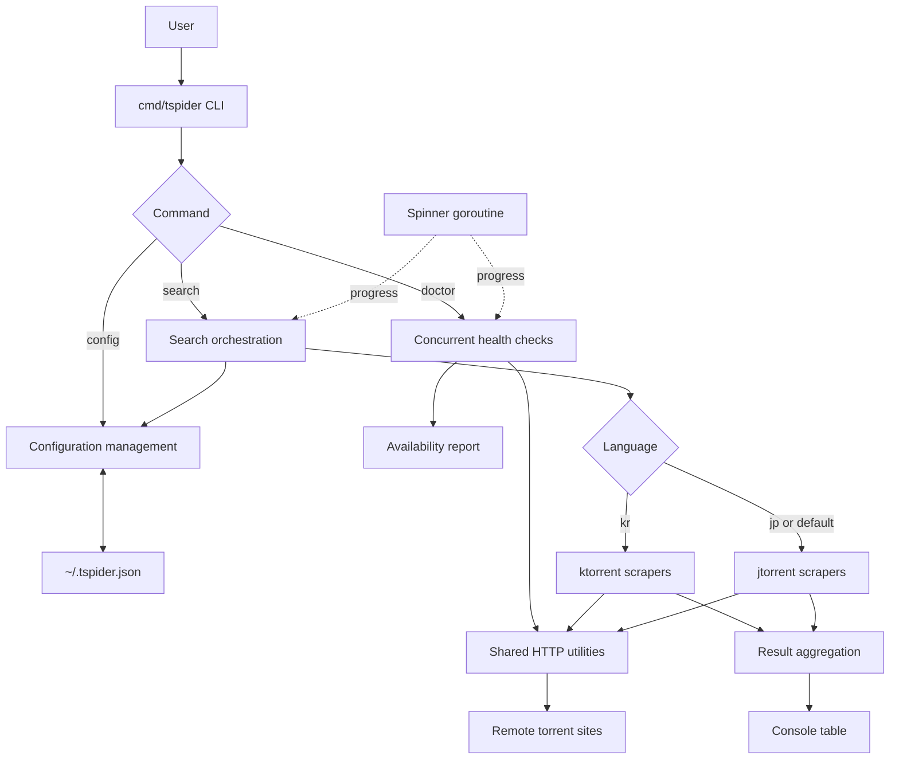
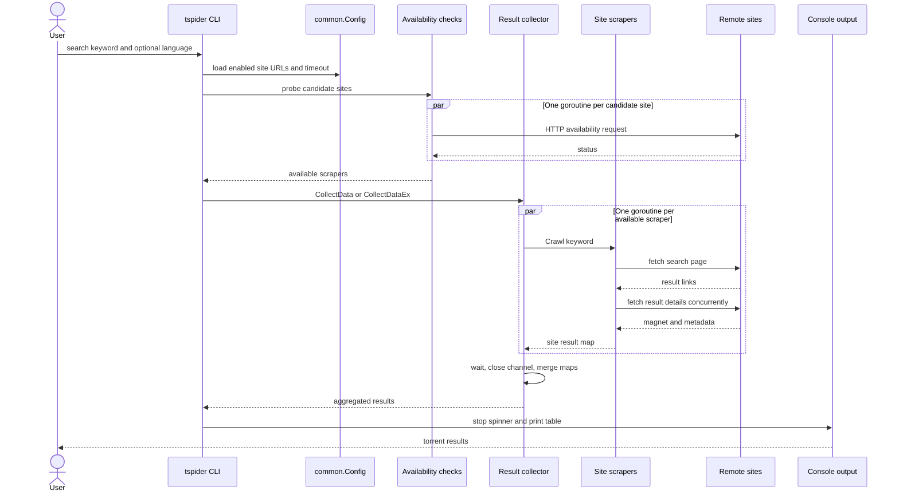
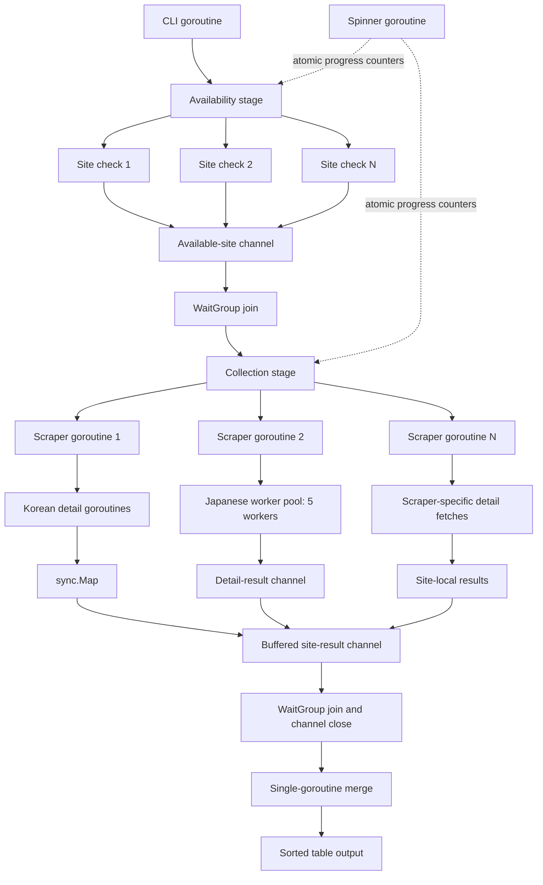

[](http://godoc.org/github.com/daite/tspider)

<p align="center">
  
</p>

# TSpider - Torrent Spider CLI

A fast, concurrent torrent search aggregator written in Go.

## Features

- Search multiple torrent sites concurrently
- **Doctor command** to check site availability
- **Configurable site URLs** (useful when sites change domains)
- Animated progress spinner with ETA
- Support for Korean (17 sites) and Japanese (2 sites) torrent sites

## Installation

```bash
go install github.com/daite/tspider/cmd/tspider@latest
```

Or build from source:

```bash
git clone https://github.com/daite/tspider.git
cd tspider
make build
```

## Usage

### Search for torrents

```bash
# Search Japanese sites (default)
tspider "keyword"
tspider search "keyword"

# Search Korean sites
tspider -l kr "keyword"
tspider search -l kr "keyword"
```

### Check site availability (Doctor)

```bash
# Check all sites
tspider doctor

# Check only Korean sites
tspider doctor -l kr

# Check only Japanese sites
tspider doctor -l jp
```

### Manage configuration

```bash
# List all configured sites
tspider config list

# Update a site's URL (when site changes domain)
tspider config set-url torrenttop https://torrenttop999.com

# Add a new site
tspider config add mysite https://mysite.com kr

# Remove a site
tspider config remove mysite

# Enable/disable a site
tspider config enable torrentqq
tspider config disable sukebe
```

## Configuration

Configuration is stored in `~/.tspider.json`:

```json
{
  "sites": {
    "torrenttop": {
      "url": "https://torrenttop152.com",
      "enabled": true,
      "language": "kr"
    },
    "nyaa": {
      "url": "https://nyaa.si",
      "enabled": true,
      "language": "jp"
    }
  },
  "user_agent": "Mozilla/5.0 ...",
  "timeout_seconds": 10
}
```

### Supported Sites

**Korean (kr):**
- torrenttop, torrentqq, tshare, torrentmobile, ktxtorrent
- jujutorrent, torrentgram, torrentmax, torrentrj, torrentsee
- torrentsir, torrentsome, torrenttoast, torrentwiz, torrentj
- torrentview, ttobogo

**Japanese (jp):**
- nyaa, sukebe (sukebei)

## Architecture

```text
tspider/
├── cmd/tspider/     # CLI entry point
├── common/          # Config, Doctor, Spinner, utilities
├── ktorrent/        # Korean torrent site scrapers
├── jtorrent/        # Japanese torrent site scrapers
└── tests/           # Unit tests
```

The CLI is the orchestration layer. It selects a command, loads shared
configuration from `common`, and delegates searches to scraper implementations
through either the `Scraping` or `ScrapingEx` interface.



### Search workflow



### Concurrency model

TSpider uses goroutines at several levels. `sync.WaitGroup` creates a clear join
point at each level, channels transfer completed results to the aggregator, and
the spinner runs independently while work is in progress.



- Availability checks fan out one goroutine per candidate site.
- `CollectData` and `CollectDataEx` fan out one goroutine per available scraper;
  their buffered channel has room for one result map per scraper.
- Korean scrapers fetch result detail pages concurrently and store them in a
  `sync.Map`. The currently selected Korean search path uses `torrenttop`.
- Japanese scrapers use five workers per site to limit concurrent detail
  requests and reduce the chance of HTTP `429 Too Many Requests` responses.
- The spinner protects its message with a mutex and tracks progress with atomic
  counters, so rendering does not race with worker updates.
- Each stage waits for its workers before closing its channel. The final map is
  merged by one goroutine after collection, avoiding concurrent writes to it.

## Authors

- **daite** - *Original author & maintainer* - [GitHub](https://github.com/daite)
- **Claude (Anthropic)** - *Refactoring & new features* - Doctor command, config management, spinner animation, project restructuring

## Changelog

### v1.0.0
- Added `doctor` command to check torrent site availability
- Added `config` command to manage site URLs dynamically
- Added animated progress spinner with ETA
- Added JSON configuration file (`~/.tspider.json`)
- Refactored for better Go concurrency patterns
- Renamed project from `angel` to `tspider`

## References

- [Korean Torrent Sites List](http://jaewook.net/archives/2613)

## License

MIT
